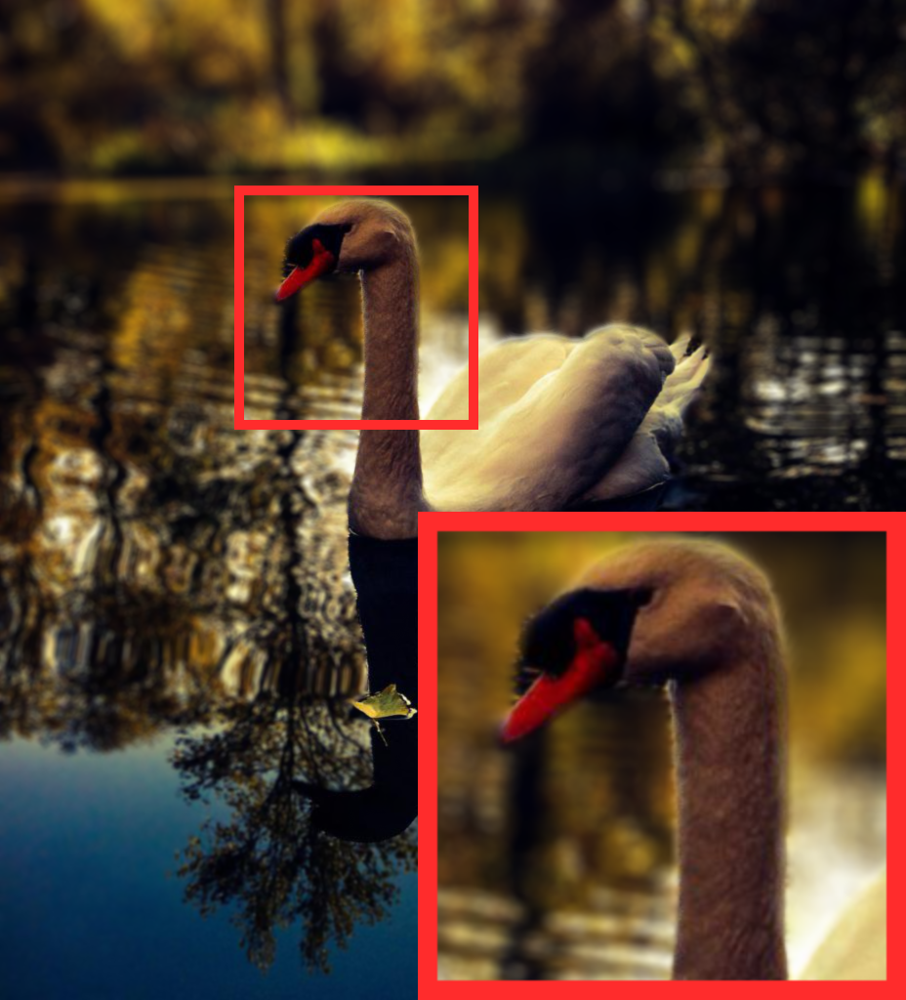
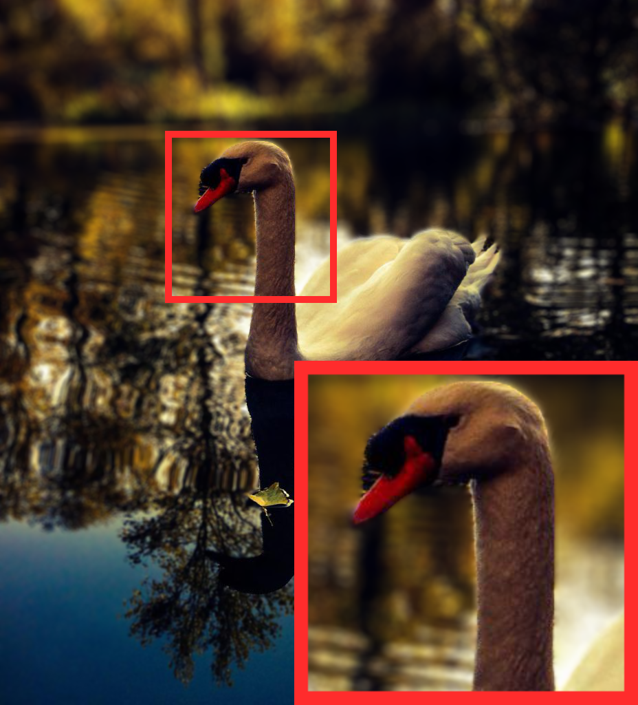

# Paper Utilities
Here are some very useful features that is frequently used in my paper writing.  

# Features
## Image Zoom-in
See the file *Image_Zoomin.py* and *Image_ZoomIn.ipynb*.
Example: 

Clasic             | DScatter 
:-------------------------:|:-------------------------:
  |  
